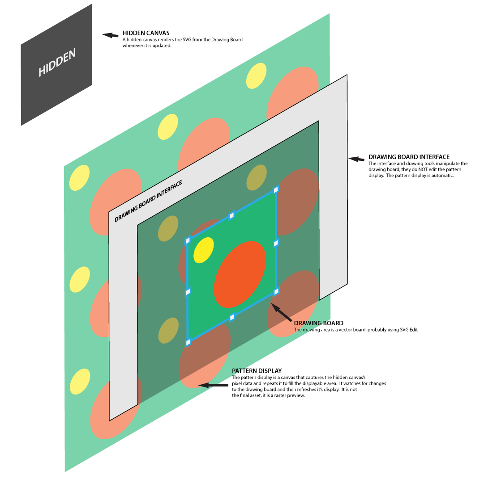

##About

This prototype is to test the architecture of a vector drawing tool, that allows users to create patterns ready for print.

Since it's really important to see the pattern in repetition, to get an idea how it will look on something physical, this project is to test vector editing with rasterized displaying.

##Architecture



The system works with a central Raphaeljs controlled SVG element.  When changes are made to the element, the SVG tag is exported.

That exported SVG is rendered into a hidden canvas tag, which will be used as the basis for the repeating pattern in the background.

Finally, a large browser window sized canvas sits behind everything else.  It samples the pixel data from the hidden canvas and draws a repeating pattern.


##Installation Instructions

1. ```npm install```

2. ```bower install```

3. ```grunt``` or ```grunt serve```
